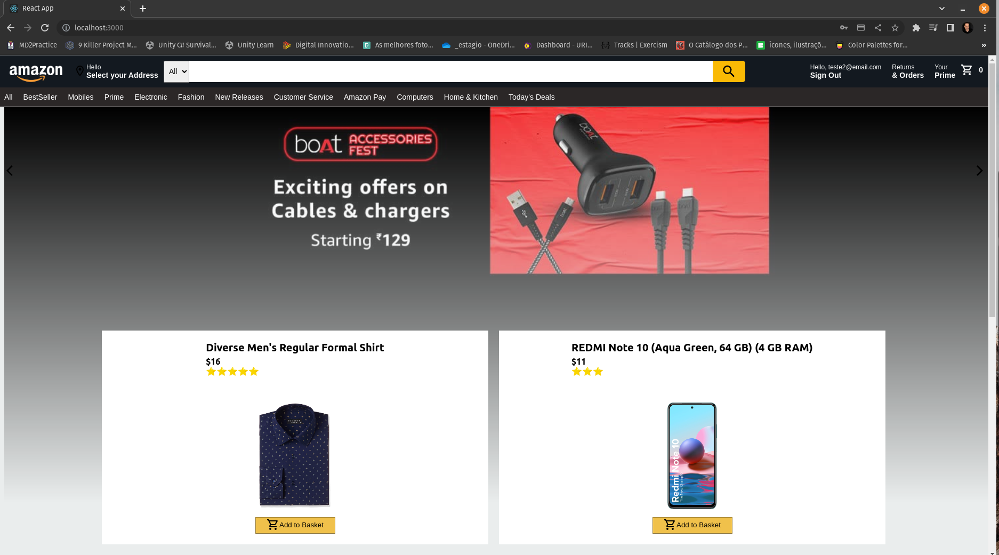
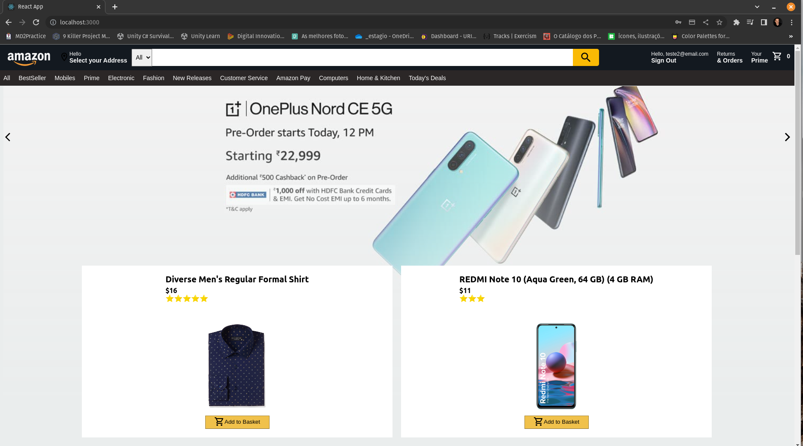
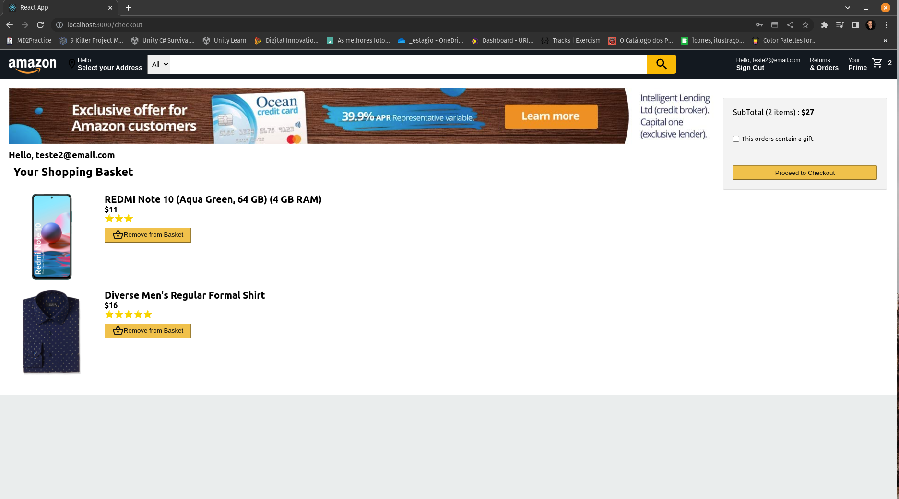
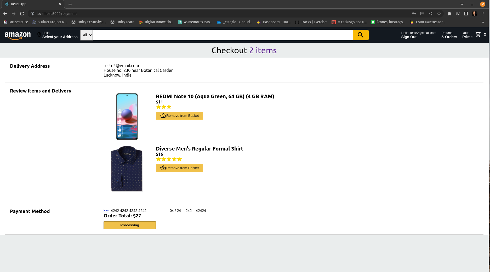
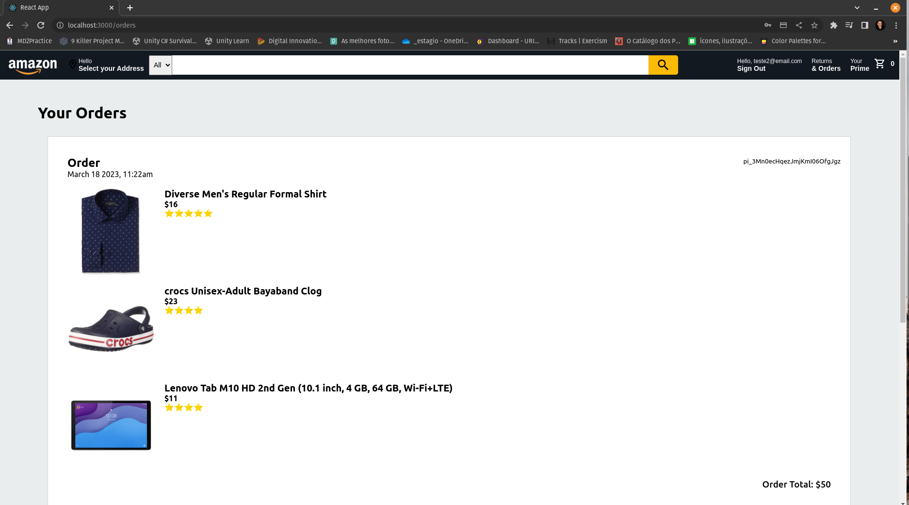

# Amazon clone website

This project is a simple clone of Amazon's website 2021's version. It was build using React, React-Thunk, Redux and Stripe.

## Screenshots

## Configuration
You will need a Firebase account and install firebase library and tools.
Change the file *firebase.js* to config your secret key.

## How to run yourself

In the project root and *functions* directory, run:
##### `npm install`

To start application execute at *functions* directory to start back-end service:
##### `npm run serve`

And at the root directory, execute to start application:
##### `npm start`

Runs the app in the development mode.\
Open [http://localhost:3000](http://localhost:3000) to view it in your browser.

The page will reload when you make changes.\
You may also see any lint errors in the console.

